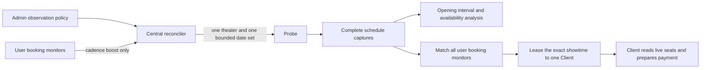

# Observation flow

- The operator selects a theater and the rolling date horizon. Central owns all cadence and priority decisions.
- A theater has at most one active policy and one active assignment, regardless of users, movies, or auditoriums.
- Hot assignments check the union of active monitor dates. Baseline assignments check one date at a time; a persisted
  cursor eventually covers the configured horizon without blocking hot work. The horizon is not the delay between
  scans.
- A pending or running booking monitor raises the matching theater to the demand range. A triggered monitor no longer
  raises discovery priority because its exact showtime is already known.
- Unknown-showtime demand is rechecked after a randomized 2-5 second delay, subject to the duration of the previous
  scan. Once the exact showtime is known, its shared live-seat snapshot is also due after 2-5 seconds. Both always
  outrank recent-change and ordinary collection work.
- Recent-change analysis uses 15-30 seconds and ordinary collection uses 5-15 minutes. These values are product
  policy, not admin form inputs.
- A newly observed showtime with a previous complete absence activates the burst range for the configured duration.
- Every range is additive random jitter: maximum must be greater than minimum. Exact fixed polling is rejected.
- The first-ever capture is left-censored and cannot prove when a showtime opened.
- Holds and cancellations can increase availability, so the analysis does not label depletion as confirmed ticket sales.
- A seat layout is a reusable immutable snapshot, while collection/validation is a separate Central-owned state
  machine. A live exact-showtime result may carry both availability and layout; Central stores both atomically and
  evaluates the exact preset before scheduling any follow-up. A missing or changed layout queues one state row, never
  a timestamp-only request. Once an exact layout is available, the Client opens the exact showtime and applies the
  preset to CGV's current live seats.
- Monitor time windows use the theater's local time as a half-open interval: the start is included and the end is
  excluded. If the end is earlier than the start, the window crosses midnight; a Saturday 01:00 showtime remains a
  Saturday target.

## Scheduling order

Central assigns each work class a fixed, non-overlapping priority band and then selects the oldest due work inside
that class. The `hot` and `baseline` values are bounded-date coverage lanes inside schedule discovery, not separate
products or user-selectable monitor modes:

| Lane | Work |
| --- | --- |
| `P0` | Active booking demand whose matching showtime is not yet known |
| `P1` | Exact-showtime live-seat availability for a known target |
| `P2` | Recently changed theater/date coverage during its observation window |
| `P3` | Ordinary shared observation |

The bands are fixed at P0 90, P1 85, P2 60, and P3 at most 30. Catalog refresh and static seat-layout work remain P3,
so an operator refresh cannot delay a due booking target. The queue does not accumulate scores. Recent-change work
returns to its normal class when its observation window expires.

CGV login is not required to enter the live seat page. Probes may therefore collect anonymous seat observations for
analysis, while the user-scoped Client always reads the seats again immediately before selection. Account and
non-member booking sessions stay on the Client.

## Query multiplicity

The scheduling invariant reduces one theater/date cycle from `K` user-intent
fetches to one shared fetch. For example, ten matching intents require one CGV
schedule request instead of ten, a structural 90% reduction. Live latency and
bandwidth were not benchmarked because this change has not been deployed to a
production CGV workload; the unique active-policy and active-assignment database
constraints are the verification boundary before rollout.

## Hot-date planning and probe wakeups

Central projects the union of every active monitor's explicit dates and weekday
targets in the monitor's search horizon. A hot assignment contains only that
union. The ordinary baseline advances one date per assignment through the
policy horizon. A hot assignment is selected first; once it finishes, the
persisted lane timestamps require one baseline date before recurring hot work
can claim the next slot. This closes the fairness gap even when a 5-second
reconcile tick misses a nominal 2-second hot interval. The single
active-assignment guard is the concurrency boundary, so a second assignment for
the same theater is never run concurrently. Central stores a canonical hash of
the active monitor projection in task data; a changed target preempts a queued
baseline before the next hot assignment is created.

The schedule-discovery coverage sequence is `hot -> baseline(one date) -> hot`; a new hot target is
therefore never hidden behind a multi-day baseline assignment. The planner's
14-date cursor test proves that continuous demand still reaches every date in
the rolling horizon. On the reviewed CGV path, the previous 14-date baseline
had a structural estimate of `1.85s + (14 * 0.5s) = 8.85s`; one-date chunks
reduce that to `1.85s + 0.5s = 2.35s` per baseline assignment, a 6.50s (73.4%)
reduction before queueing and network variance. These are path estimates, not a
production benchmark; no live Central database was used for this change.

Only a `completed` assignment advances lane progress. `partial`, `failed`, and
`missed` assignments do not unlock recurring hot work or advance the baseline
date cursor; the same demand or date remains eligible for a retry. A newer
non-completed hot attempt also blocks an older successful hot timestamp from
unlocking baseline work until hot demand completes again. Seat-map collection is
governed by its durable state row: due queued/retry states are selected only when
a matching future showtime exists (and that showtime is copied into the task when
known), a collecting row points at exactly one assignment, and waiting/blocked
rows are not recreated by a five-second maintenance tick. Only typed Probe deferred
outcomes (`no_bookable_showtime` or `target_date_unavailable`) can enter waiting;
Central derives `showtime_not_discovered` when its catalog has no future candidate.
Provider blocking/throttling, browser start, provider transport/server, and timeout
failures use Central retry/backoff. Probe selection considers `available_slots` and
active assignment backlog before a collection is created.

Probe claim keeps the immediate durable claim attempt, then waits on PostgreSQL
`LISTEN/NOTIFY` for up to 5 seconds. The repository rechecks eligibility after
installing the listener and after every notification, so a missed notification
cannot lose an assignment. Assignment creation, retry/requeue, terminal
release, result commit, and probe-slot recovery publish the wakeup in their
own transaction; an empty response after the bound is normal.

The previous 2–5 second polling loop had a measured structural worst case of
5 seconds before a probe could observe a newly queued assignment. The event
path removes that polling interval: its bound is one committed state change
plus notification and scheduling overhead, with a 5-second empty-wait ceiling.
Production wake latency is not claimed here because no live Central database
workload was available in this change; the repository integration test proves
the committed assignment notification path when `CINEKO_CENTRAL_TEST_DATABASE_URL`
is provided, while the default unit suite proves the durable wait/retry boundary.

The reconciler now arms an adaptive timer from the earliest durable P0/P1
deadline and listens for committed assignment/client-resource wakeups. Under
the same deterministic test condition (a 2-second fast-lane deadline and a
5-second maintenance interval), the old fixed ticker waited 5 seconds while
the scheduler arms a 2-second timer: a 3-second (60%) reduction in nominal
wake delay. The test is structural rather than a production latency
benchmark; the maintenance fallback remains bounded at 5 seconds when no
deadline is available or a deadline is already due.
