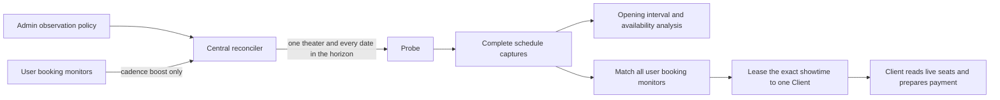

# Observation flow

- The operator selects a theater and the rolling date horizon. Central owns all cadence and priority decisions.
- A theater has at most one active policy and one active assignment, regardless of users, movies, or auditoriums.
- Each assignment checks today and every later date through the configured horizon. The horizon is not the delay
  between scans.
- Active monitor target dates and weekdays are unioned per theater and intersected with the policy horizon before the
  Probe assignment is created. This prunes provider date requests; an empty filter means all policy dates.
- A demand monitor with no usable date or weekday filter still raises the theater's demand lane, but deliberately scans
  the full policy date horizon rather than silently dropping the booking request.
- A pending or running booking monitor raises the matching theater to the demand range. A triggered monitor no longer
  raises discovery priority because its exact showtime is already known.
- Opening and cancellation demand use the policy's configured demand interval; burst work uses the configured burst
  interval; ordinary collection uses the configured baseline interval. The interval is randomized after each terminal
  run and is not a hard-coded lane constant.
- Active demand is a scheduling class ahead of catalog/seat-map maintenance and ordinary collection. The configured
  numeric priority is still used for ordering policies inside the same class and for non-demand assignments.
- A newly observed showtime with a previous complete absence activates the burst range for the configured duration.
- Every range is additive random jitter: maximum must be greater than minimum. Exact fixed polling is rejected.
- The first-ever capture is left-censored and cannot prove when a showtime opened.
- Holds and cancellations can increase availability, so the analysis does not label depletion as confirmed ticket sales.
- A seat layout is not required for matching or execution. Once matched, the Client opens the exact showtime and
  applies the preset to CGV's current live seats.

## Scheduling order

Central selects work by demand class, then the stored policy priority, then due time:

| Lane | Work |
| --- | --- |
| `P3` | Opening demand for an active booking monitor |
| `P2` | Burst/changed-showtime work during its observation window |
| `P1` | Cancellation-seat demand for an active booking monitor |
| `P0` | Baseline catalog and ordinary shared observation |

The policy's stored priority and all three stored interval ranges are the source of truth. Active booking demand is
promoted above maintenance work; opening, burst, cancellation, and baseline assignments use separate reserved
priority bands, while the configured priority orders policy selection within each class. Recent-change work returns to
its normal lane when its observation window expires. An older due time wins after class and priority.

Start-time windows are evaluated against the show's calendar date and Asia/Seoul start time after the full-day response
is received. They do not reduce the provider date request itself. The window is half-open; a later start than end is a
cross-midnight union, and equal bounds match nothing. Client and Central use the same `TimeWindowContains` semantics.

CGV login is not required to enter the live seat page. Probes may therefore collect anonymous seat observations for
analysis, while the user-scoped Client always reads the seats again immediately before selection. Account and
non-member booking sessions stay on the Client.

## Query multiplicity

The scheduling invariant reduces one theater/date cycle from `K` user-intent
fetches to one shared fetch. For example, ten matching intents require one CGV
schedule request instead of ten, a structural 90% reduction. Live latency and
bandwidth were not benchmarked because this change has not been deployed to a
production CGV workload; the unique active-policy and active-assignment database
constraints are the verification boundary before rollout.
