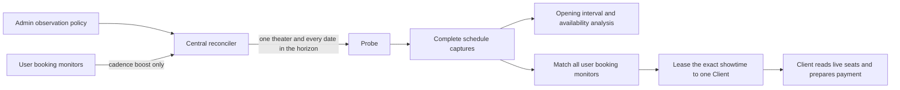

# Observation flow

- The operator selects a theater and the rolling date horizon. Central owns all cadence and priority decisions.
- A theater has at most one active policy and one active assignment, regardless of users, movies, or auditoriums.
- Each assignment checks today and every later date through the configured horizon. The horizon is not the delay
  between scans.
- A pending or running booking monitor raises the matching theater to the demand range. A triggered monitor no longer
  raises discovery priority because its exact showtime is already known.
- Opening demand is rechecked after a randomized 2-5 second delay, subject to the duration of the previous scan. It
  always outranks ordinary and recent-change collection work.
- Recent-change analysis uses 15-30 seconds and cancellation monitoring uses 30-45 seconds. Ordinary collection uses
  the operator-independent baseline. These values are product policy, not admin form inputs.
- A newly observed showtime with a previous complete absence activates the burst range for the configured duration.
- Every range is additive random jitter: maximum must be greater than minimum. Exact fixed polling is rejected.
- The first-ever capture is left-censored and cannot prove when a showtime opened.
- Holds and cancellations can increase availability, so the analysis does not label depletion as confirmed ticket sales.
- A seat layout is not required for matching or execution. Once matched, the Client opens the exact showtime and
  applies the preset to CGV's current live seats.

## Scheduling order

Central selects work by lane first and due time second:

| Lane | Work |
| --- | --- |
| `P0` | Active booking demand whose matching showtime is not yet known |
| `P1` | Recently changed theater/date coverage during its observation window |
| `P2` | Known-showtime cancellation-seat demand |
| `P3` | Ordinary shared observation |

Numeric policy priority only breaks ties inside the same lane. It cannot lift an ordinary scan above active booking
demand. Recent-change work returns to its normal lane when its observation window expires. An older due time wins
inside the same lane.

CGV login is not required to enter the live seat page. Probes may therefore collect anonymous seat observations for
analysis, while the user-scoped Client always reads the seats again immediately before selection. Account and
non-member booking sessions stay on the Client.

## Query multiplicity

The scheduling invariant reduces one theater/date cycle from `K` user-intent
fetches to one shared fetch. For example, ten matching intents require one CGV
schedule request instead of ten, a structural 90% reduction. Live latency and
bandwidth were not benchmarked because this change has not been deployed to a
production CGV workload; the unique active-policy and active-assignment database
constraints are the verification boundary before rollout.
