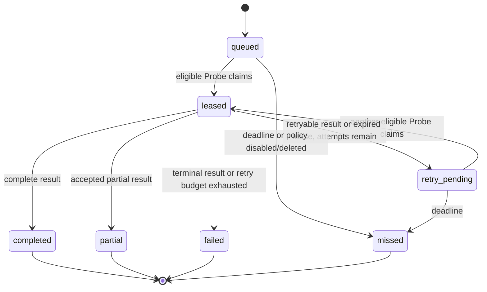
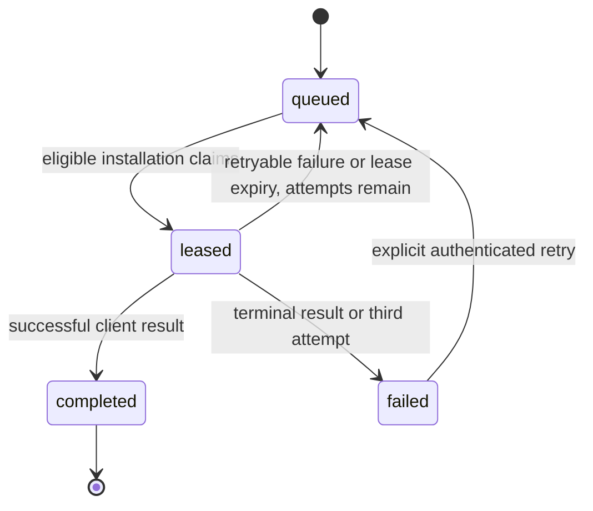

# State, retry, and retention contract

## Probe and observation work

- Probe runtime state is `online` or `offline`, independently `healthy` or
  `degraded`, with a `draining` flag. Heartbeat staleness moves `online` to
  `offline`; registration/heartbeat moves a valid runtime to `online`; explicit
  disconnect moves it to `offline`.
- An assignment attempt is `leased`, then `completed`, `partial`, `failed`, or
  `expired`. `(assignment, probe)` is unique, so a failed Probe is not selected for
  that assignment again. Retry delay is additive random jitter from the configured
  retry range and cannot pass the assignment deadline.
- `completed`, `partial`, `failed`, and `missed` assignments are terminal.
  A policy records the terminal outcome and schedules its next run. A policy is
  enabled/disabled and active/soft-deleted; only enabled, active, due policies run.
- A due policy with no eligible Probe stays due and creates no assignment row. This
  avoids unbounded terminal-row amplification while inventory is unavailable.
- Catalog-refresh and seat-map-backfill assignments are system work and do not need
  an observation policy. Their assignment window is ten minutes. A failed catalog
  refresh becomes eligible again after one minute.

## Policy cadence

- Baseline, demand, and burst are randomized closed-open duration ranges whose maximum
  is greater than minimum. The reconciler chooses a fresh value after each outcome.
- The policy's stored baseline, demand, and burst intervals are used directly; no
  scheduler-side interval constants replace the values saved by the Admin UI.
  Active booking demand is promoted above maintenance and ordinary work. Opening,
  burst, cancellation, and baseline assignments have reserved priority bands;
  stored numeric priority orders policies inside the same class.
- Active monitor dates and weekdays are unioned per theater and intersected with
  the policy horizon before assignment creation. Start-time windows remain a
  post-fetch filter in the theater's configured time zone.
- A newly discovered showtime activates `burst_until`; expiry returns the policy to
  demand or baseline cadence. Disabling/deleting a policy atomically clears its next
  due time and marks any active assignment missed with the policy reason.
- At most one active assignment exists per policy. Its lifecycle, not browser tabs or
  user count, is the shared-work boundary.

## Client execution

- A queued command whose exact showtime has started is terminally failed with
  `showtime_started` before claim. It is never handed to a Client after the
  booking window has already begun.
- Claim ordering gives an active monitor whose preset auditorium matches the
  command a target boost, then prefers the newest discovered command. `created_at`
  and `id` are deterministic tie-breakers; stale showtimes are removed before
  selection. A separate bounded-fairness policy is not encoded with an arbitrary
  age score.

- A command has at most three lease attempts. `completed` is terminal; `failed` is
  terminal until the owning user explicitly retries it, which resets the attempt budget.
- Execution matching uses the monitor's canonical `movieId` and preset auditorium
  identity. A legacy title-only monitor is fail-closed and does not enqueue a
  booking command; title text is display-only and may change without changing identity.
- The unique user/monitor/showtime/start key prevents duplicate commands for the same
  execution identity. New, automatic-retry, and explicit-retry transitions emit one
  durable `execution.ready.v1` event; conflict/queued replay emits none. A database
  trigger notifies the user-scoped event stream only when that transaction commits.
- The lease is bound to one user installation and an opaque token hash. Another device
  cannot heartbeat or complete it. User deletion cascades execution commands.

## Authentication, resources, catalog, and releases

- Client/admin sessions are active until revoked or expired. Refresh rotates the client
  refresh token; logout and user deletion revoke reachability immediately. Launch and
  Probe bootstrap tickets are pending, then consumed or expired, and never reusable.
- A client resource is active or soft-deleted. Revisions increase monotonically.
  Durable resource commands make an identical mutation replay-safe. Event sequence and
  the per-user prune cursor are monotonic.
- New monitor mutations require the canonical `movieId` plus display title. Title-only
  legacy rows are not valid configuration input and are ignored by execution matching
  until explicitly migrated.
- Catalog refresh is idle, requested, or running. Catalog snapshots are additive and
  omission is never evidence of deletion. Only successful full catalog-assignment
  completion clears the refresh request. Seat layout is missing, requested, or
  available; a newly stored layout clears its request marker. Catalog generation
  increments only when canonical shared content changes.
- Release component records are immutable. The desktop generation increases only when
  the fully resolvable active desktop manifest changes. Launch tickets bind that
  generation and stale generation exchange is terminal with `stale_release`.
- Startup admin credentials have two states: uninitialized (configured hashes are
  inserted) and initialized (all bootstrap input is ignored). Schema migration state is
  append-only by version and checksum; checksum mismatch blocks startup.

## Retention owners

| Data | Retention owner | Rule |
| --- | --- | --- |
| `client_events` | reconciler leader | 180 days, bounded deletion; advance per-user prune cursor and notify stream consumers |
| offline `probe_runtimes` | reconciler leader | configured offline retention, 30 days by default, only when no active leased assignment references the Probe; historical attempts do not retain it |
| in-memory admin login attempts | admin HTTP limiter | inactive records older than 24 hours |
| `client_pin_attempts` | PIN authentication transaction | reset on successful scope authentication; no autonomous age deletion is currently defined |
| `consumed_probe_bootstrap_tickets` | registration path | expired records are removed while consuming/registering tickets |
| `client_launch_tickets` | launch-ticket transaction | expired/consumed state is enforced; no autonomous age deletion is currently defined |
| assignments, attempts, payloads, captures, observations | none | retained indefinitely; no current purge owner |
| catalog and seat-map versions | none | retained indefinitely; active pointers select current data |
| releases | none | immutable history retained indefinitely |
| admin/client sessions | authentication paths | expiry/revocation enforced on access; no autonomous purge owner is currently defined |
